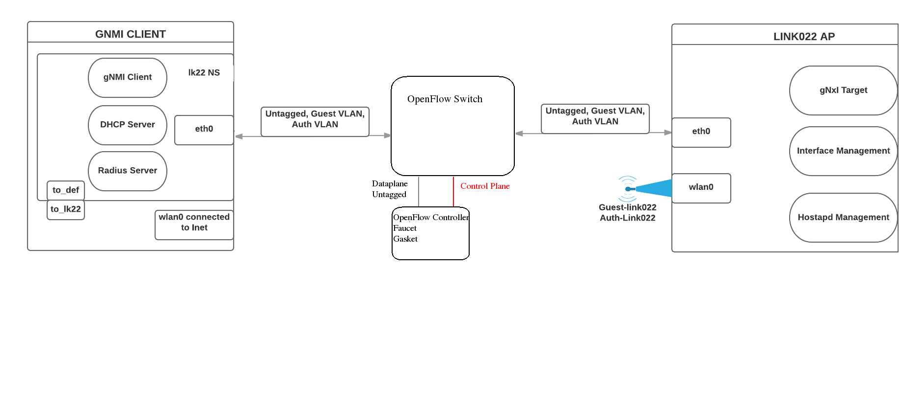

# Gasket & [Link022](https://github.com/google/link022)

## Getting Started
First *read* over [Gasket's readme](https://github.com/bairdo/gasket/blob/master/docs/README.authentication.md) for a general overview of Gasket's authentication, and the [link022 readme](./Readme.md).




We will use the [link022 demo](https://github.com/google/link022/tree/master/demo) and add an OpenFlow switch controlled by Gasket & Faucet in between the gateway and AP.
- The Controller is connected to both the dataplane (untagged) and the control plane.


## Link022 AP
Setting up a Link022 AP for use with Gasket is similar however we require a patched version of hostapd, which fixes a bug and adds a feature to allow RADIUS attributes to be saved on Access-Accept.
This is required so that we can apply ACL rules based on what user is authenticated.
Follow the steps on the Link022 github to setup except do not install the 'hostapd' application.

To install the patched hostapd:
```bash
git clone https://github.com/bairdo/hostapd-d1xf.git -b faucet-con
make
sudo make install
```

This provides a default compile configuration, that includes the UDP-remote control interface, which is used by Gasket over the network.


## Link022 Gateway
Follow the instructions [here](./README.md) to setup the gateway.

Two more configurations changes are needed:

1. Add Faucet RADIUS type to 'dictionary', and 'Faucet-ACL-ID' attribute to users in the users file.
Examples [here](https://github.com/bairdo/gasket/blob/master/docs/README.authentication.md#radius-server)

2. Add the 'vendor-config' configuration (see below) to the top level of [demo/ap_config.json](./demo/ap_config.json)

```json
{
  "vendor-config": [
        {
          "config-key": "ctrl_interface",
          "config-value": "udp:8888"
        },
        { 
          "config-key": "radius_auth_access_accept_attr",
          "config-value": "26:12345:1:s"
        }
      ],

  ###### Rest of standard link022 config.
  "hostname": "raspberrypi",
  "system":{
    "aaa":{
      "server-groups":{
        "server-group":[
          {
            "config":{
              "type":"openconfig-aaa:RADIUS"
            },

```


## Gasket.

At the moment the location (which switch and port) of the AP is hard-coded.
In gasket/auth_app.py change the return statement of _get_dp_name_and_port to "return <switch-name>, <port-number>"

e.g. "return "faucet-1", 1"


The demo gasket/faucet/... folder provides a good starting configuration for the network in the diagram above.

Configure [auth.yaml](./gasket/faucet/gasket/auth.yaml) to point to the hostapd on the Link022 AP.

See [base-no-authed-acls.yaml](./gasket/faucet/gasket/base-no-authed-acls.yaml) for an example ACL configuration.


Build and run Gasket & Faucet:
```bash
docker build -t bairdo/gasket -f Dockerfile.auth .
docker run --privileged -v ~/link022/demo/gasket/faucet:/etc/ryu/faucet/ -v <path-to-logging-dir>:/var/log/ryu/faucet/ -p 6663:6663 -p 6653:6653 -p 9244:9244 -ti bairdo/gasket
```
If using a Raspberry pi use [Dockerfile.pi](https://github.com/bairdo/gasket/blob/master/Dockerfile.pi) instead of Dockerfile.auth.


## Notes:
 - Access (which VLAN do clients belong to) to the guest and auth VLANs is provided by hostapd.
 - No ACLs are applied when a user connects to the guest SSID.
 - As access is controlled by hostapd, in theory you do not *need* to have ACLs for each user, assuming you have the base-acl config setup to allow all traffic on the VLAN.
 - Rules will be added to the switch for users authenticated on the auth SSID.


## TODO:
 - Support multiple hostapd control interfaces in Gasket.
This will allow multiple Auth SSIDs/VLANs - [issue 32](https://github.com/Bairdo/gasket/issues/32)
 - Remove the hard-coded switch and port.
Will probably take into account which hostapd authentication has occurred on.
